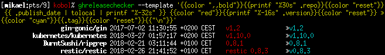

# gh_release_checker

ghReleaseChecker is a small CLI utility that uses the Github API to
periodically check a list of projects for new releases.

[](https://raw.githubusercontent.com/McKael/ghreleasechecker/master/LICENSE)
[](https://travis-ci.org/McKael/ghreleasechecker)
[](https://goreportcard.com/report/github.com/McKael/ghreleasechecker)

## Installation

Pre-built binaries of the command line utility are available from the
[Release page](https://github.com/McKael/ghreleasechecker/releases).

It can also be built from source and installed with the usual command:

```
go get -u github.com/McKael/ghreleasechecker
```

Builds are tested with Travis for Go versions 1.7+.

## Usage

By default, ghReleaseChecker outputs the new versions to stdout, which might be
suitable for a cron job, but it is possible to use a simple (Go) template or a
JSON/YAML format that can be used for automation.

A YAML configuration file is required; you can find a sample in the repository
root directory.

ghReleaseChecker uses a JSON state file, which path should be defined in the
configuration file.


Here's a sample use case:
```
% ghreleasechecker --config ./ghreleasechecker.yaml -o plain
New release for kubernetes/kubernetes: v1.10.0
  Tag: v1.10.0
  Date: 2018-03-27 01:57:17 +0200 CEST
New release for BurntSushi/ripgrep: 0.8.1
  Tag: 0.8.1
  Date: 2018-02-21 03:11:44 +0100 CET
New release for restic/restic: restic 0.8.3
  Tag: v0.8.3
  Date: 2018-02-26 21:41:52 +0100 CET
```

The output can be customized with templates, here's an example with the
default configuration file:
```
% ghreleasechecker --config ghreleasechecker.yaml
McKael/ghreleasechecker ghReleaseChecker 0.0.1 -- Initial release v0.0.1 2018-04-02 00:06:03 +0200 CEST
kubernetes/kubernetes v1.10.0 v1.10.0 2018-03-27 01:57:17 +0200 CEST
BurntSushi/ripgrep 0.8.1 0.8.1 2018-02-21 03:11:44 +0100 CET
restic/restic restic 0.8.3 v0.8.3 2018-02-26 21:41:52 +0100 CET
```

Colors can be used on terminals supporting ANSI sequences.



Please check the commented [YAML sample configuration file](ghreleasechecker.yaml)
provided with the source code for the details and the online help for CLI usage,
available with the `--help` flag:

```
% ghreleasechecker --help
ghReleaseChecker is a release watcher for Github projects.

(...)

Usage:
  ghreleasechecker [flags]

Flags:
      --color string      Color mode (auto|on|off; for output=template)
      --config string     config file (default is $HOME/.config/ghreleasechecker/ghreleasechecker.yaml)
      --debug             Display debugging details
  -h, --help              help for ghreleasechecker
  -o, --output string     Output handler (default: plain)
      --read-only         Do not update the state file
      --show-body         Display release body (for output=plain)
      --template string   Go template (for output=template)
  -t, --token string      Github API user token
      --version           Display version
      --wait              Wait when rate limit is exceeded
```
